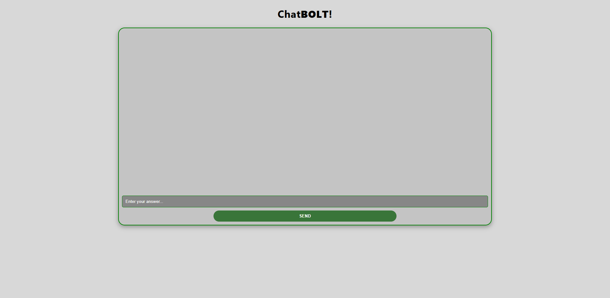

# 💬 ChatBolt

**ChatBolt** is a full-stack chatbot application that features two distinct types of bots:  
1. A custom session-based Q&A bot that records answers to 10 predefined questions.  
2. A dynamic chatbot powered by **ChatGPT**, allowing users to have natural conversations.  
All conversations and responses are stored using MongoDB.

---

## 🚀 Features

- 🔐 **Session-based Q&A Bot** for fixed 10 questions
- 🤖 **ChatGPT integration** for dynamic conversations
- 💾 All interactions stored with **MongoDB (Mongoose)**
- 🧠 Separate logic for static and AI-based responses
- 🧪 Simple and clean UI for testing bot behavior
- 📷 1 included **screenshot** of the main interface

---

## 🛠️ Tech Stack

| Layer         | Technologies                            |
|---------------|-----------------------------------------|
| Frontend      | React.js, JavaScript, CSS               |
| Backend       | Node.js, Express.js                     |
| Database      | MongoDB with Mongoose                   |
| AI Integration| OpenAI GPT API (for ChatGPT bot)        |
| Tools         | Postman, Git, GitHub, VS Code           |

---

## 📷 Screenshot

### 🧠 Main Chat Interface


---

## 📦 Getting Started

Clone the repository:

```bash
git clone https://github.com/kuyucucaner/chatbot.git
cd chatbot
cd backend / npm install 
cd frontend / npm install
npm install

---
## 🛡️ Environment Variables

PORT=5000
MONGO_URI:your_database_name
OPENAI_API_KEY:your_openai_api_key

---
## ▶️ Run the App
 npm start 
